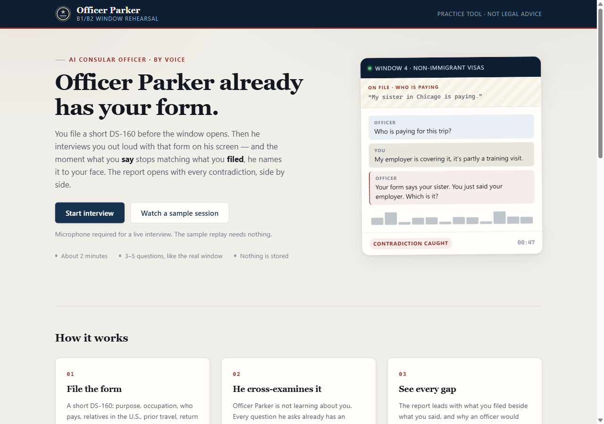
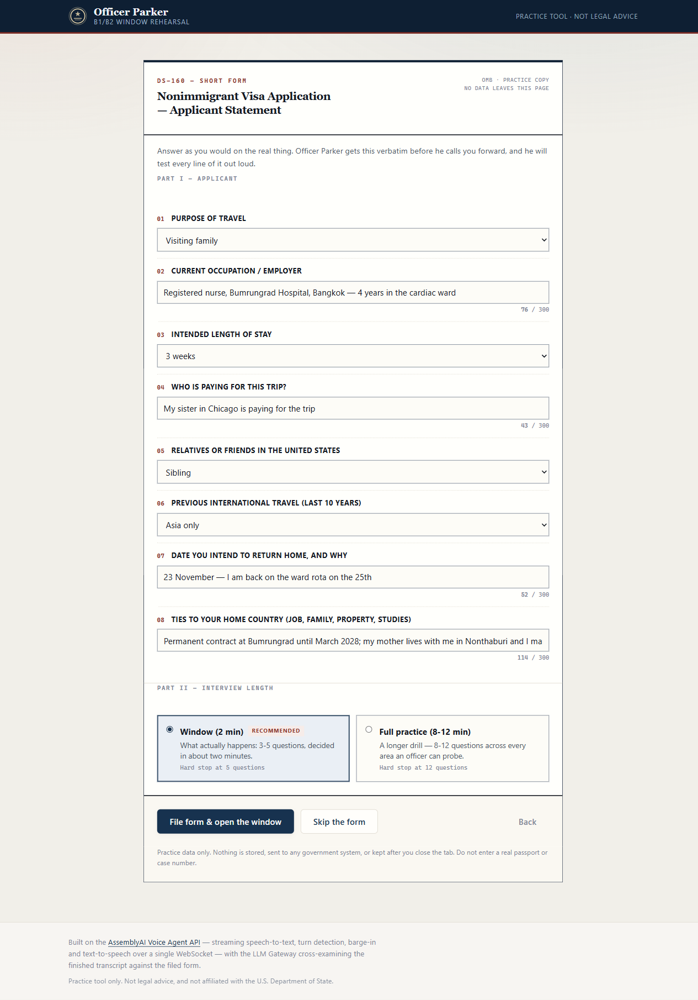
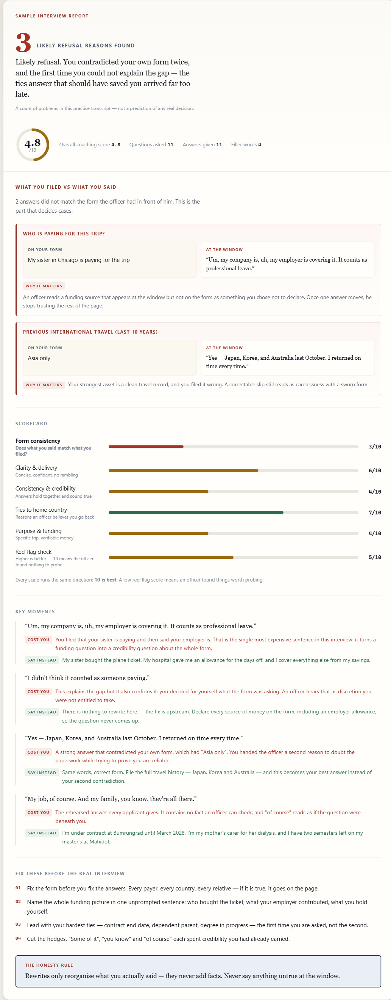

# 🛂 Officer Parker

**File a short DS-160. Then face a consular officer who already has it on screen — by voice, in real time — and watch him catch every place your answers stop matching your own form.**

<!-- DEMO_URL -->
<!-- VIDEO_URL -->

[](https://lablab.ai/ai-hackathons/assemblyai-voice-agent-hackathon)
[](https://nodejs.org)
[](./package.json)
[](./LICENSE)

**Live demo:** _(paste URL above the badges once deployed)_ · **Demo video:** _(same)_
Built for the [AssemblyAI Voice Agent Hackathon](https://lablab.ai/ai-hackathons/assemblyai-voice-agent-hackathon) (lablab.ai, Sep 2026).

---

> ### ⚠️ Read this first
> Officer Parker is a **practice tool only**. It is **not affiliated with, endorsed by, or connected to
> the U.S. Department of State, U.S. Customs and Border Protection, or any U.S. government agency**.
> The "consular officer" is an AI role-play for rehearsal. Nothing it says is **legal advice**, and
> its score has **no bearing whatsoever** on a real visa decision. For advice about your own case,
> talk to a licensed immigration attorney. Do not enter real passport numbers, case numbers, or
> other sensitive personal data.

---

## Why

Millions of people take the B1/B2 interview every year. It lasts 2–4 minutes, and most applicants have never heard what a real consular window sounds like: fast, brisk, one probing question after another.

But the thing that actually sinks applicants is narrower than "being nervous". **A real consular officer is not meeting a stranger — they have your filed DS-160 open in front of them, and the interview is a cross-examination of it.** People are refused because what they *say* at the window drifts from what they *filed* weeks earlier: a different payer, a longer stay, relatives who were not on the form. A generic mock interview cannot surface that, because it has nothing to check you against.

So Officer Parker collects the form first, hands it to the officer as fenced data, and lets him do what a real one does — ask questions whose answers he already has, and name the divergence out loud the moment it appears. When you press **End Interview**, a former-officer-persona LLM lists every contradiction between what you filed and what you said, scores you on the dimensions consular officers actually weigh, and tells you how to fix them without ever inventing a fact for you.

## Screenshots

| Landing | DS-160 intake | Score report |
|---|---|---|
|  |  |  |

## How it works

```
DS-160 short form ───────▶ buildOfficerPrompt(form, mode) — the form is fenced as DATA
browser mic ──24kHz PCM──▶ AssemblyAI Voice Agent API (one WebSocket)
                            ├─ Universal-3 Pro streaming STT
                            ├─ LLM (officer persona + the filed form "on his screen")
                            ├─ neural turn detection + barge-in
                            └─ TTS voice out ──▶ browser playback
End Interview ─┬─transcript─▶ AssemblyAI LLM Gateway (Claude) ──▶ contradictions + 6-dim report
               └─filed form ─┘   └─ deterministic filler-word count (applicant turns only)
```

The browser never holds the API key. `GET /api/token` mints a short-lived (300 s) Voice Agent
token server-side; the page opens the WebSocket with that. `POST /api/report` is the only other
server call, and it happens once, at the end.

### Where AssemblyAI is used

| Piece | AssemblyAI product | Where in this repo |
|---|---|---|
| Short-lived browser credential | Voice Agent API token endpoint | `api/token.js` |
| Real-time speech-to-text | Voice Agent API (Universal-3 Pro streaming) | `public/app.js` (one WebSocket) |
| Turn-taking / barge-in | Voice Agent API neural turn detection | `public/app.js` |
| Officer voice replies | Voice Agent API TTS | `public/app.js` (playback queue) |
| Officer persona + form cross-examination | Voice Agent API LLM leg | `public/persona.js` |
| Post-interview contradiction hunt + scoring | LLM Gateway (`/v1/chat/completions`) | `api/report.js` |

One WebSocket carries STT, LLM and TTS. There is no second vendor anywhere in the audio path.

## Run it yourself

```bash
git clone https://github.com/gun321h-creator/visa-coach
cd visa-coach
cp .env.example .env          # then put your key in it: ASSEMBLYAI_API_KEY=...
npm run dev                   # → http://localhost:3000
```

Open <http://localhost:3000> in Chrome, press **Start Interview**, allow the microphone.

**There is no `npm install` step.** This project has **zero runtime dependencies** — no Express,
no SDK, no bundler, no build. It runs on Node 22's built-in `fetch`, `WebSocket`, `node:http`, and
`--env-file`. The whole thing is plain ESM you can read top to bottom in a few minutes, which is
also why the deploy is a static folder plus two functions.

Requires Node ≥ 22 (`node -v`) and a browser with microphone access (Chrome recommended).

### Smoke test (no mic needed)

```bash
npm run smoke
```

Verifies: temp-token minting → Voice Agent WebSocket handshake (`session.ready`) → LLM Gateway
report generation. Use this to confirm your key works before you debug audio.

## Deploy

Vercel, zero build step. `vercel.json` pins the layout explicitly rather than relying on
inference:

- `outputDirectory: "public"` — the static site
- `functions: { "api/*.js": ... }` — `api/token.js` and `api/report.js` as Node functions
- `framework: null`, `buildCommand: null` — nothing to build
- `engines.node: "22.x"` in `package.json` pins the function runtime major

Set `ASSEMBLYAI_API_KEY` in **Project Settings → Environment Variables** and deploy. `.vercelignore`
keeps `scripts/`, `docs/` and `server.js` (local dev only) out of the bundle; `lib/` stays, because
the functions import it.

The API routes ship with same-origin checks, a best-effort per-IP rate limit (30 token mints and
10 reports per minute), and transcript size caps — see `lib/guard.js`. For a public deployment,
also set a **spend cap on the AssemblyAI account** — that is the real backstop, not the limiter.

## The DS-160 cross-examination

This is the mechanic the whole project is built around, and it runs end to end:

1. **You file a short form.** Eight fields — purpose, occupation, length of stay, who pays, U.S.
   relatives, prior travel, return plan, home ties. The UI renders them by iterating `FORM_FIELDS`
   out of `public/persona.js`, so the form on screen and the form in the officer's prompt cannot
   drift apart. It is **skippable**: an interview with no form still runs, and the report degrades
   honestly rather than inventing filed answers.
2. **You pick a length.** *Window (2 min)* is the default and the recommended one — 3–5 questions,
   which is what a real busy post actually gives you. *Full practice (8–12 min)* is the longer drill.
   The budget is enforced inside the officer prompt, not just in the UI copy, and the console's
   question counter follows the chosen mode.
3. **The officer gets the form as data, never as instructions.** `buildOfficerPrompt(form, mode)`
   fences it between `<<<FORM_BEGIN>>>` / `<<<FORM_END>>>`, strips control characters, angle
   brackets and any forged fence markers, and caps each field at 300 characters. The prompt tells
   the officer that anything inside the fence which reads like a command is a *suspicious answer*,
   not an instruction. `api/report.js` re-sanitises independently on the server.
4. **He checks, he does not learn.** The prompt's primary instruction is to ask questions whose
   answers are already on his screen, and to interrupt and quote both sides the moment they diverge:
   *"Your form says your sister in Chicago is paying. You just said your employer. Which is it?"*
5. **The report leads with the gaps.** `POST /api/report` takes `{ transcript, form }` and returns a
   `contradictions` array of `{ field, filed, said, why_it_matters }`. The UI renders **what you
   filed beside what you said** as the first and largest thing on the page. `filed` is re-derived
   server-side from our own sanitised copy of the form, so the model cannot smuggle text into it.

The report header leads with **`refusal_reasons_found`** — a count of distinct problems found in
*this transcript* — rather than the 1–10 overall. That is deliberate: a bare score from something
calling itself a consular officer reads as a prediction of a federal decision, and this tool has no
calibration to make one. The overall gauge is still there, demoted to a footer strip.

## The honesty guardrail

A coaching tool that writes better answers for you is one step from writing false ones, and a false
answer at a real visa window is a far worse outcome than a refusal. So:

- The scoring prompt carries an absolute **honesty rule**: every "say instead" rewrite must be built
  only from facts the applicant actually stated. No invented salary, employer, property, relative,
  itinerary or amount.
- Fill-in-the-blank rewrites are banned, because a blank (`"I earn [X] per month"`) is an invitation
  to invent a fact at the window. `scrubInventedPlaceholders()` in `api/report.js` is the
  deterministic backstop for when a small fallback model ignores the instruction — it replaces any
  bracketed placeholder with a plain instruction to bring the real answer instead.
- When a weak answer *cannot* be improved without a fact the applicant never gave, the model is told
  to say so rather than fill the hole.
- Every report prints the rule verbatim: *"Rewrites only reorganise what you actually said — they
  never add facts. Never say anything untrue at the window."*

## Scoring rubric (6 dimensions)

1. **Form consistency** — does what you said match what you filed? *(present only when a form was filed)*
2. **Clarity & delivery** — concise, confident answers
3. **Consistency & credibility** — no contradictions across answers
4. **Ties to home country** — job, family, property, studies
5. **Purpose & funding** — specific itinerary, credible sponsor
6. **Red flags** — immigration-intent signals a real officer would probe (INA 214(b))

Alongside the scores, the server computes a **deterministic filler-word count over the
applicant's turns only** — a plain regex pass over `role === "user"` text for `um`, `uh`, `like`,
`you know`, `i mean`, `sort of`, `kind of` and friends, with the top offenders broken out. The LLM
is explicitly told not to guess this number, so the count is reproducible for the same transcript
and does not drift between runs.

## Known limitations

Being straight about what this is and is not:

- **Chrome-first.** The capture path uses `AudioWorklet` and asks for a 24 kHz `AudioContext`.
  Chrome and Edge honour that; Safari and some Firefox builds may resample or refuse, which
  degrades or breaks the audio leg. Tested on desktop Chrome.
- **No persistence.** Nothing is stored server-side. No database, no accounts, no transcript
  history. Reload the page and the session is gone.
- **The report is ephemeral.** It lives in the browser tab only. There is no export, no share
  link, no way to compare two sessions over time. That is deliberate for a hackathon build and
  a privacy nicety, but it is a real product gap.
- **Free-tier model.** The LLM Gateway leg asks for `claude-sonnet-5` and automatically falls back
  to a small model (`qwen3.5-4b-32k-fast`) when the account lacks access. On a free key you will
  usually get the small model, and the report's prose quality drops accordingly. The five scores
  and the filler count still come back in the same shape.
- **The rate limiter is in-memory and per-instance.** Serverless instances do not share state, so
  the effective limit is looser than the numbers suggest. It slows casual abuse; it is not a
  security control.
- **Practice tool, not a predictor.** The rubric is a coaching heuristic modelled on what officers
  weigh. It is not the adjudication standard, and a good score is not a signal about a real
  outcome.
- **The cross-examination is only as good as the form you file.** Skip the form and the whole
  differentiator switches off — the report says so plainly instead of pretending otherwise. The
  contradictions themselves are LLM-extracted, so a small fallback model finds fewer of them.
- **English only**, and the officer persona is a single archetype — no post-specific variation.

## Troubleshooting

| Symptom | Cause / fix |
|---|---|
| **"Microphone permission denied"** / nothing happens after Start | The browser blocked mic access. Click the padlock (or camera icon) in the address bar → **Site settings** → allow **Microphone**, then reload. Note `getUserMedia` requires a secure context: `https://` or `http://localhost` — a plain `http://<LAN-IP>:3000` will silently fail. |
| Audio connects but the officer mishears you badly | The browser did not honour the 24 kHz sample rate. `AudioContext({ sampleRate: 24000 })` is a *request*; some browsers and some Bluetooth headsets resample to 44.1/48 kHz, which shifts the pitch of what the model receives. Use desktop Chrome, and pick a wired or built-in mic in **chrome://settings/content/microphone** rather than a Bluetooth headset. |
| **HTTP 429 `too many requests — slow down`** | You hit the per-IP limiter in `lib/guard.js`: 30 token mints or 10 reports per 60 s. Wait a minute. If you are demoing to a room behind one NAT, every viewer shares your IP — raise `BUDGETS` in `lib/guard.js` before the demo, or hand out the URL and let people run it on their own network. |
| **HTTP 403 `cross-origin requests are not allowed`** | The `Origin` header did not match the host. You are hitting the API from a different origin than the page — open the app from the same URL the functions are deployed under. |
| **502 `LLM gateway failed`** on End Interview | Usually model access on the free tier. `api/report.js` already retries on a small model; if it still fails, unset `REPORT_MODEL` (or set it to `qwen3.5-4b-32k-fast`) and check the key has LLM Gateway enabled in the AssemblyAI dashboard. A 401/403 here means the key, not the model. |
| **500 `ASSEMBLYAI_API_KEY not configured`** | Locally: you ran `node server.js` without `--env-file`, or `.env` is missing. Use `npm run dev`. On Vercel: the env var is not set for the environment you deployed to (Production vs Preview are separate). |
| Everything fails before you even see the UI | Run `npm run smoke` — it isolates key → token → WebSocket → gateway without touching the microphone. |

## How this maps to the judging criteria

**Application of Technology.** The Voice Agent API is used as one integrated pipeline, not as a
speech-to-text box bolted onto something else: a single WebSocket carries streaming STT, the
officer-persona LLM, neural turn detection with barge-in, and TTS. The key never reaches the
browser — `api/token.js` mints a 300-second token. The LLM Gateway then does a second, different
job (structured JSON scoring), so two distinct AssemblyAI products each do what they are best at.

**Presentation.** No signup. File a short form, talk for two minutes, read the report — and the
form step is deliberately styled as plain paperwork so the contrast with the interview is felt, not
explained. The repo is readable end to end — zero dependencies, no build step, no bundler —
so a judge can clone it and have it running in about thirty seconds.

**Business Value.** The B1/B2 interview is a high-stakes, few-minute, once-per-application event
with a large refusal rate, and existing prep is text checklists or paid consultants. Voice
rehearsal under time pressure is the part nobody can practise alone. The same shape generalises to
any adversarial interview — asylum, F-1, employment screening — which is the commercial path.

**Originality.** Most voice-agent demos are cooperative: a helpful assistant. This one is
deliberately *uncooperative* — an interviewer who probes, interrupts, and does not coach you while
you are on the record. The part nobody else is doing is the **document cross-examination**: the
agent is handed the applicant's own filed form as fenced, untrusted data, and its job is to find
where the person diverges from their own paperwork. That is what a consular window actually is, and
it turns a mock interview into something with a right answer. The deterministic filler count is
measured, not guessed by the model.

## Project layout

```
public/       static app — index.html, app.js (intake + WebSocket + audio + report render),
              persona.js (FORM_FIELDS, MODES, officer prompt), demo-session.js (sample replay),
              worklet.js (24kHz PCM capture)
api/          Vercel functions — token.js (mint), report.js (score)
lib/guard.js  same-origin check + per-IP rate limit, shared by both functions
scripts/      smoke.mjs — headless end-to-end check
server.js     local dev only; mirrors the Vercel static + /api routing
```

## Disclaimer

See the box at the top. Practice tool only. Not affiliated with the U.S. Department of State or any
U.S. government agency. Not legal advice.

## License

[MIT](./LICENSE)
